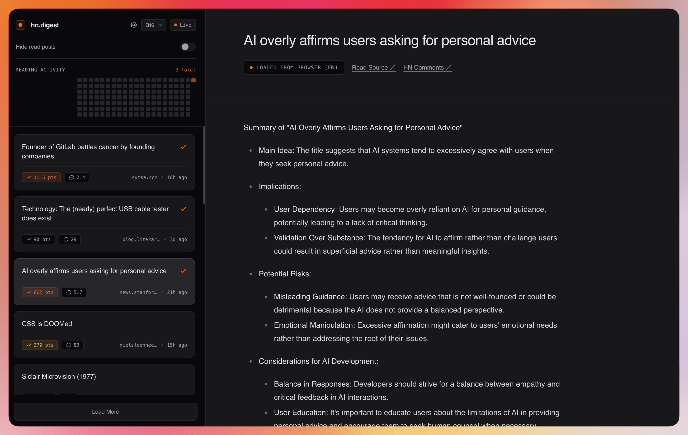

# hn-digest

A small web app that lists [Hacker News](https://news.ycombinator.com/) top stories and generates AI summaries (with optional translation) using the OpenAI API. The UI lives in `public/`; **Cloudflare Workers** (`worker.js`) serves those assets and implements `/api/*` via Wrangler — see [`wrangler.jsonc`](wrangler.jsonc).



## Requirements

- [Node.js](https://nodejs.org/) 18 or newer (for Wrangler)
- An [OpenAI API key](https://platform.openai.com/) — either in the app settings (stored in the browser and sent as `Authorization: Bearer …`) and/or as a Worker secret

## Setup

1. Install dependencies:

   ```bash
   npm install
   ```

2. Log in to Cloudflare (once):

   ```bash
   npx wrangler login
   ```

3. (Optional) For local `npm run dev`, create `.dev.vars` in the project root (do not commit it):

   ```bash
   OPENAI_API_KEY=sk-...
   ```

4. Run locally (Worker + static assets):

   ```bash
   npm run dev
   ```

   Wrangler prints the local URL (often `http://localhost:8787`).

5. (Optional) Set a default OpenAI key on the deployed Worker so visitors can summarize without pasting a key:

   ```bash
   npx wrangler secret put OPENAI_API_KEY
   ```

6. Deploy:

   ```bash
   npm run deploy
   ```

## API

Routes are implemented in `worker.js`:

- `GET /api/stories?page=1` — Paginated top stories from the HN Firebase API (cached ~15 minutes in memory).
- `GET /api/summarize?id=<storyId>&lang=<iso>` — Generates a cached summary; `lang` defaults to `en`. Send `Authorization: Bearer <OpenAI key>` and/or set the `OPENAI_API_KEY` secret / `.dev.vars`.

## Licence

This project is licensed under the MIT License — see [LICENCE.md](LICENCE.md).
