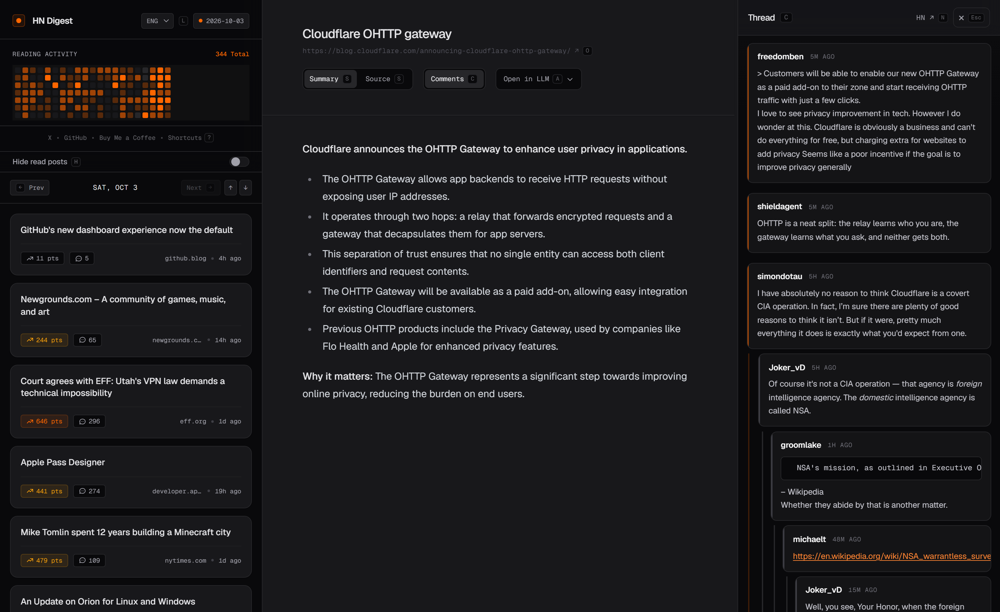

# hn-digest

A small web app that shows the day's top 10 [Hacker News](https://news.ycombinator.com/) stories with English and Turkish AI summaries. Summaries are generated once a day by a local script and published to Cloudflare KV; the site only serves that prepared content and never calls an AI API itself.



## How it works

- `scripts/daily-digest.mjs` fetches the top 10 stories, summarizes each in English and Turkish with a single `gpt-4o-mini` call, caches summaries per story, writes `digests/<date>.{json,md}` and uploads the JSON to the `DIGEST` KV namespace.
- `worker.js` serves the static UI from `public/` and the digest at `GET /api/digest` (`?date=YYYY-MM-DD` optional; defaults to the latest).

## Requirements

- [Node.js](https://nodejs.org/) 22 or newer
- An [OpenAI API key](https://platform.openai.com/) on the machine that runs the daily script
- A Cloudflare account with a KV namespace for the digests, and Wrangler logged in (`npx wrangler login`)

## Setup

```bash
npm install
```

Copy the example config files and fill them in:

- `.env.example` → `.env`, then set `OPENAI_API_KEY`
- `wrangler.example.jsonc` → `wrangler.jsonc`, then set your KV namespace ID (create one with `npx wrangler kv namespace create hn-digest`)

Both copies are git-ignored.

Run the digest once (add `--no-upload` to skip publishing):

```bash
npm run digest
```

Past days come from HN's Algolia search (the highest-scoring stories posted that day). Build one day, or backfill several; days that already have a digest are skipped:

```bash
node scripts/daily-digest.mjs --date 2026-09-30
node scripts/daily-digest.mjs --backfill 10
```

Deploy the site:

```bash
npm run deploy
```

## Scheduling

The script runs on macOS, Linux, and Windows. Run `npm run digest` once a day with any scheduler; each run also updates the list of available days. Run it once by hand first so the `digests/` folder exists.

macOS / Linux (`crontab -e`), every day at 07:00:

```bash
0 7 * * * cd /path/to/hn-digest && npm run digest >> digests/run.log 2>&1
```

Windows (Command Prompt), every day at 07:00:

```bat
schtasks /create /tn "hn-digest" /sc daily /st 07:00 /tr "cmd /c cd /d C:\path\to\hn-digest && npm run digest >> digests\run.log 2>&1"
```

Things to keep in mind:

- The command has to run from the project folder, because `.env` and `wrangler.jsonc` are read from there.
- Wrangler needs to be logged in. `npx wrangler login` is remembered on your machine; on a server or CI runner, set `CLOUDFLARE_API_TOKEN` instead.
- The digest date comes from the machine's time zone, so set `TZ` on servers or CI runners that use UTC (for example `TZ=Europe/Istanbul`).

## URLs

- `/en`, `/tr`: the latest digest in English or Turkish (`/` redirects to `/en`)
- `/<lang>/<date>`: a day's top 10, e.g. `/en/2026-09-28`
- `/<lang>/<date>/<slug>`: a single story, e.g. `/tr/2026-10-03/zig-v0-17-0`

Slugs are generated from the title when the digest is built and are unique within a day. To add slugs to digests built before they existed, run `node scripts/daily-digest.mjs --reslug`.

## API

- `GET /api/digest?date=YYYY-MM-DD`: daily digest JSON (latest when `date` is omitted).
- `GET /api/digests`: dates that have a digest, newest first. The Reading Activity calendar uses it to make those days clickable.
- `GET /api/embed-check?url=…&parent=…`: best-effort check whether a source page can be shown in an iframe.

## Licence

This project is licensed under the MIT License. See [LICENCE.md](LICENCE.md).
